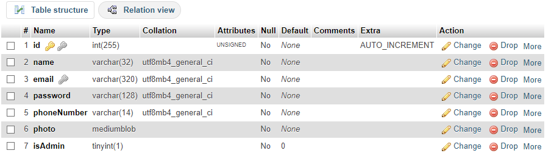

# SECDV_MP
## Project BE Setup

1. install **XAMPP**
Can be downloaded from this link:
https://drive.google.com/file/d/1Q9yUCn9qiDJeljYKNIt_TfEYfo_FlTab/view?usp=sharing

2. Run **Xampp installer**

Note: don't install in "Program Files" folder if antivirus popups appear (install in a separate folder or drive)
      can check to install everything, but only Apache and MySQL are required

3. Run **Xampp** and start **Apache** and **MySQL** 
Note: if MySql is not running due to port issues (especially if port 3306 has issues), stop any background MySQL apps using task manager (ex: mysqld)

4. Click **Admin under MySQL** to open the MySQL databases

5. Create a new "cssecdv" db with a table "users" which contains columns: id (int 255) as PK, unsigned, auto_increment, name (varchar32), email (varchar32), password (varchar 320), phoneNumber (varchar 14), photo (mediumblob), and isAdmin(Boolean with default value 0), **Note: when making your admin account, manually change the isAdmin of that account to 1**

5.1 Alternately, you can also import using the .sql files in the SCHEMA folder (cssecdv.sql for database, users.sql for table) 
5.2 See image for what the table is supposed to look like:

Note: Check the .env file under Server folder if there are issues with your database and check if they match 
If the .env file is missing, create one with the following content:
            DB_HOST=localhost
            DB_USER=root
            DB_PASS=    
            DB_DATABASE=cssecdv
            PORT=3001

After preparing everything mentioned above, you can start installing the libraries and run the BackEnd

6. cd BE

7. npm install

8. Run using "nodemon index.js" or "node index.js"

**NOTE**: When making changes, reset the BE server to make sure changes have been applied